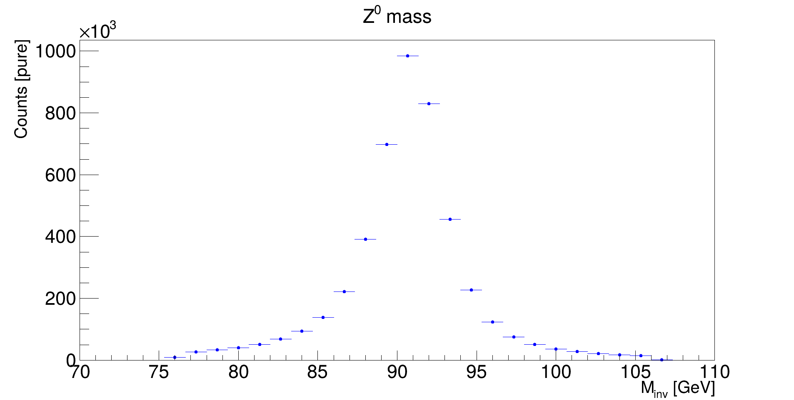
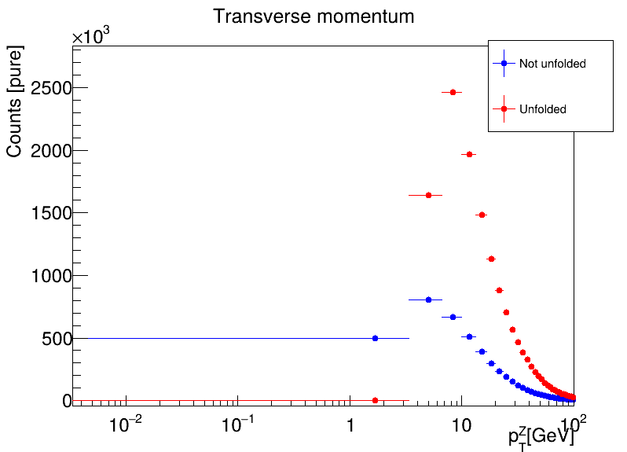
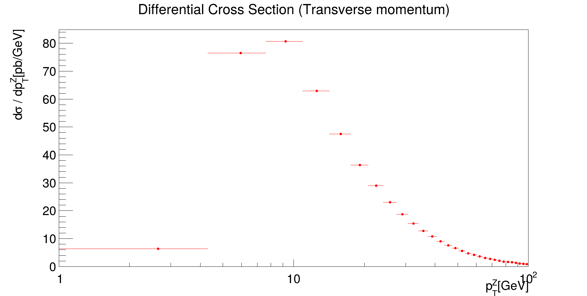
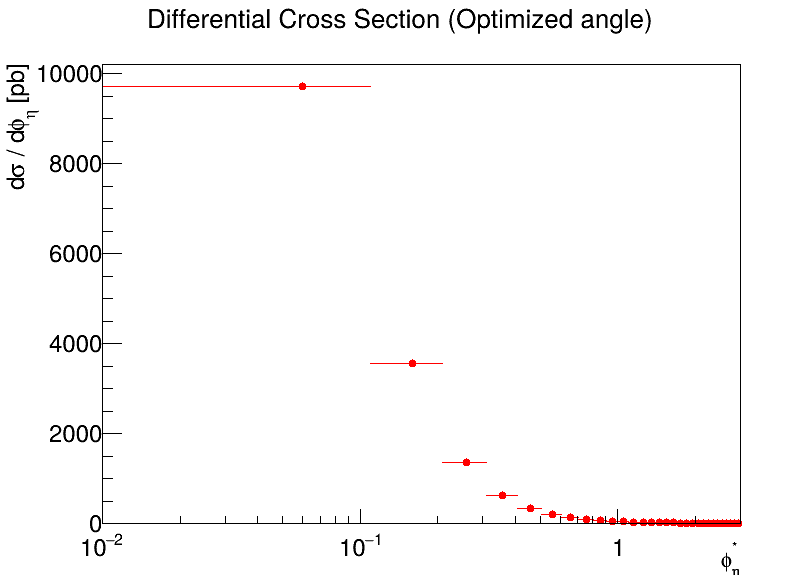
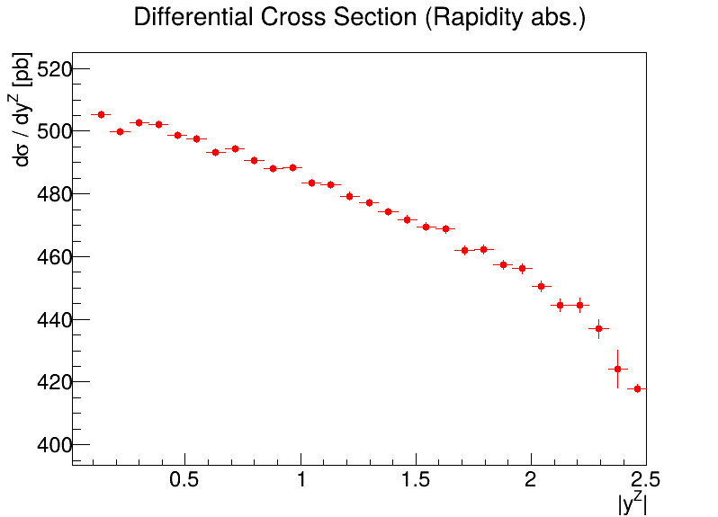

# CMEPDAexam
Repository on the project made for the exam of Computing Methods for Experimental Physics and Data Analysis. 

Link to documentation : https://luxnasone.github.io/CMEPDAexam/ (Alternatively found in: Settings->Pages)

The task is to reproduce the measurement of the differential production cross section for $Z^{0}$ in p-p collision at 13 TeV made by CMS with open data. 

For the article we refer to: https://cms-results.web.cern.ch/cms-results/public-results/publications/SMP-17-010/index.html.

We select muon pairs applying the cuts described in the article:

- n = 2;
- $p_{t_{i}}$ > 25 GeV $i = 1, 2$;
- $|\eta_{i}|$ < 2.4 $i = 1, 2$;
- $\Delta R_{i}$ < 0.15 $i = 1, 2$;
- $|m_{i} - 0.1057| < 2.5 \cdot 10^{-5}$ $ i = 1,2$
- $q_{1} + q_{2}$ = 0;

We find the usual Breight-Wigner peak around expected $Z^{0}$ mass :  

After finding the resonance of the $Z^{0}$ and selecting events with $|m_{inv} - m_{Z^{0}}|$ <  15, we calculate distributions for the following quantities:

- transverse momentum : $P_{t}$;
-  rapidity : $y$;
- optimized angle : $\phi_{\eta} tan\left(\frac{\pi - \Delta \phi}{2}\right)sin\left(\theta_{\eta}\right)$;

With $cos\left(\theta_{\eta}\right) = tanh\left(\frac{\Delta \eta}{2}\right)$.

In order to to take into account inefficiencies we performed an unfolding procedure, estimating the response matrix with data generated from a Montecarlo and using the RooUnfold toolbox.
The generated events are determined to be $Z^{0}$ decays in two muons by:

- Selecting $\pm$ 13 PDG ID to select muon pairs;
- Finds index for mother particle and controls if it is 23 ($Z^{0}$ PDG ID);

Then on the same dataset we apply the cut of the article to have a generated-reconstructed match. The response matrix is then obtained by using RooUnfoldResponse. We then use a RooUnfoldBayesian oon measured distribution. For example, here is a comparison between unfolded and not unfolded distribution for transverse momentum:

By scaling with the correct integrated luminosity and the bin-width we obtain the following differential cross section:

